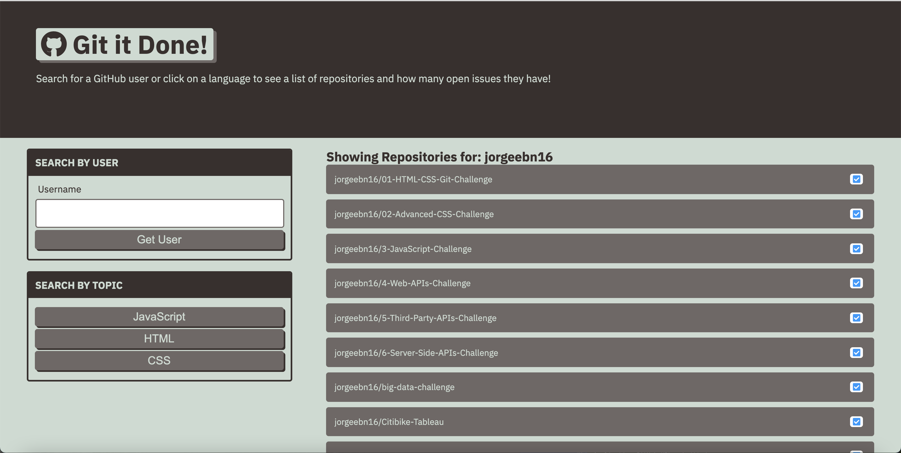

# Git-It-Done

 

## Purpose
Git-It-Done is a GitHub's API to search for open source projects with open issues and pull requests.
 

## Contents
1. [Requirements/Description](#requirements/description)
2. [Installation](#installation)
3. [Contribution](#contribution)
4. [Built With/Technologies](#built-with/technologies)
5. [Issues](#issues)
 

## Requirements/Description
### Description
* Users can enter a GitHub username and see a list of all repos from that account.
* Repos with no open issues will display a checkmark.
* Repos with open issues will display an X with the number of issues or pull requests.
* Users can click on a repository name, which will route them to a new page.
* The second HTML page will display a list of all open issues for that repository.
* Users can click on a language button to see a list of featured repos that use that language.- Examples: HTML, CSS, JavaScript.  - The list of featured repos will look exactly like the list of user repos.
 

## Installation
An application that will run in the browser and feature dynamically updated HTML and CSS powered by JQuery. Application features polished UI and is responsive, ensuring adaptation to multiple screen sizes.
 

### Link to Git It Done
[Git It Done](https://jorgeebn16.github.io/Git-It-Done//)
 

### Screenshot

 

## Contribution
Made with ❤️ by Jorge Navarro
 

## Built With/Technologies
* [HTML5](https://developer.mozilla.org/en-US/docs/Web/Guide/HTML/HTML5)
* [CSS](https://developer.mozilla.org/en-US/docs/Web/CSS)
* [Javascript](https://developer.mozilla.org/en-US/docs/Web/JavaScript)
* [jQuery](https://jquery.com/)
* [Font Awesome](https://fontawesome.com/)
* [Bootstrap](https://getbootstrap.com/)
* [Google Fonts](https://fonts.google.com/)
 

## Issues

